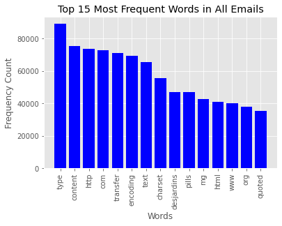
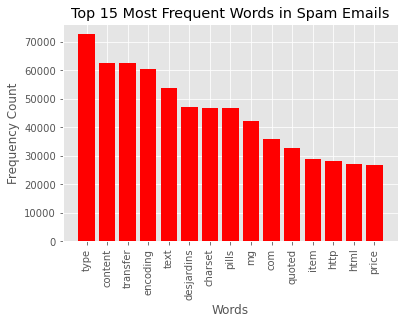
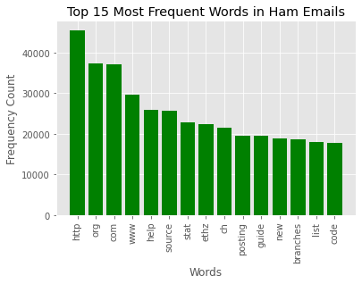
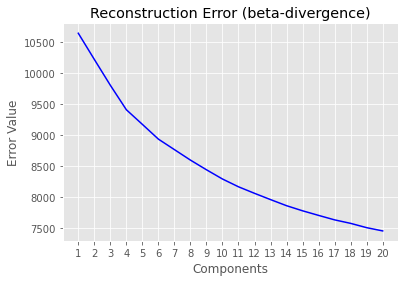
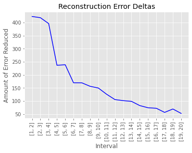
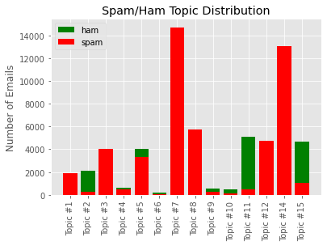

# Email Spam Detector

## Purpose

The purpose of this project is to produce a predictive machine learning model that will be able to determine whether an email is spam or "ham" (legitimate email) specifically based on the text content within the email.

## Context

### What is Spam?
Spam email is considered similar to the junk mail one would recieve in their physical mail. The majority these spam emails are unsolicited commercial advertising and simply result in clogging up your email inbox. Unlike regular junk mail though, not only is email spam annoying, but may contain potentially dangerous content including:

- links to websites meant to steal personal information or download malware
- a seemingly legitimate file attachment that has malware embedded.

Today, email spam is prevelant as ever. In November 2020, the average daily volume were as follows:

- 210.54 Billion Average Daily Spam Volume (84.84% of total global email traffic)
- 38.16 Billion Average Daily Legitimate Volume (15.16% of total global email traffic) 

Source: https://talosintelligence.com/reputation_center/email_rep#global-volume (Provides most-up-to-date statistics)

## The Dataset

The data is contains 75,419 emails in a raw text files with an index file containing the spam or ham labels for each email text file. The email text files included all data found in an email such as metadata, html code, MIME information, text and etc.

## Data Cleaning Process

Overview: Data existed as raw email text files which needed to be parsed and loaded into a Pandas Dataframe for further analysis. The steps to create this data were take as follows:

1. Used glob module to produce a list of paths to every email file
2. With the above list, used Beautiful Soup module to parse only text from the raw email and filtered out metadata.
3. Loaded email text data into a dataframe with corresponding email filename and label.

Snippet of dataframe shown below:

|filename | email | label | 
|:-----:|:-----:|:-----:|
| inmail.1 | ----8896484051606557286Content-Type: text/html... | spam |
| inmail.2 | Hi, i've just updated from the gulus and I che... | ham |
| inmail.3 | --F05E057D3F0C38DA4867D386Content-Type: text/p... | spam |
| inmail.4 | Hey Billy, it was really fun going out the oth... | spam |
| inmail.5 | This is a multi-part message in MIME format.--... | spam |

## Exploratory Data Analysis

For exploratory data analysis, since the data existed in a text format, the CountVectorizer module was used to calculate the frequency of terms used in the emails.

## Model Selection and Performance Metrics

### CountVectorizer - MultimodalNB Pipeline
| Email  | Precision |  Recall |
|:-----:|:-----:|:-----:|
| ham | 0.97 | 0.99 | 
| spam | 1.00 | 0.98 | 
| | |
| accuracy | | 0.99 |

### CountVectorizer - RandomForestClassifier Pipeline
| Email  | Precision |  Recall |
|:-----:|:-----:|:-----:|
| ham | 1.00 | 0.41  | 
| spam | 0.77 | 1.00 | 
| | |
| accuracy | | 0.80  |

### CountVectorizer - LogisticRegression Pipeline
| Email  | Precision |  Recall |
|:-----:|:-----:|:-----:|
| ham | 1.00 | 0.99  | 
| spam | 0.99 | 1.00 | 
| | |
| accuracy | | 1.00 |

### TfidfVectorizer - MultimodalNB Pipeline
| Email  | Precision | Recall |
|:-----:|:-----:|:-----:|
| ham | 1.00 | 0.98  | 
| spam | 0.99 | 1.00 | 
| | |
| accuracy | | 0.99 |

### TfidfVectorizer - RandomForestClassifier Pipeline
| Email  | Precision |  Recall |
|:-----:|:-----:|:-----:|
| ham | 1.00 | 0.43  | 
| spam | 0.78 | 1.00 | 
| | |
| accuracy | | 0.81 |

### TfidfVectorizer - LogisticRegression Pipeline
| Email  | Precision |  Recall |
|:-----:|:-----:|:-----:|
| ham | 1.00 | 0.98  | 
| spam | 0.99 | 1.00 | 
| | |
| accuracy | | 0.99 |

#### Hyperparameters Used
- CountVectorizer: ngram_range=(1,2), stop_words='english'
-TfidfVectorizer: ngram_range=(1,2), stop_words='english'

- MultimodalNB: (defaults) alpha = 1
- RandomForestClassifier: n_estimators=100, max_depth=15, n_jobs=3
- LogisticRegression: (defaults)

## Timed Performance

### CountVectorizer - MultimodalNB Pipeline
- Fitting: 46.284623910001756 Seconds
- Prediction: 8.046062818999417 Seconds

### CountVectorizer - RandomForestClassifier Pipeline
- Fitting: 50.648976462000064 Seconds
- Prediction: 12.270083813000383 Seconds

### CountVectorizer - LogisticRegression Pipeline
- Fitting: 176.41575912500048 Seconds
- Prediction: 7.889089341000727 Seconds

### TfidfVectorizer - MultimodalNB Pipeline
- Fitting: 51.95789749600044 Seconds
- Prediction: 9.171469327000523 Seconds

### TfidfVectorizer - RandomForestClassifier Pipeline
- Fitting: 55.09434158899967 Seconds
- Prediction: 13.381683207000606 Seconds

### TfidfVectorizer - LogisticRegression Pipeline
- Fitting: 121.97665342599976 Seconds
- Prediction: 9.28232515900163 Seconds

## Analysis of Results
In terms of prediction metrics and speed, the CountVectorizer MultimodalNB provided the best performance.

### Topic Modeling

#### Choosing the Number of Topics (Components)

#### Topics
| Topic #1 | Topic #2 |	Topic #3 | Topic #4 | Topic #5 	| Topic #6 	| Topic #7 | Topic #8 | Topic #9 | Topic #10 | Topic #11 | Topic #12 | Topic #13 | Topic #14 | Topic #15 |
|:-----:|:-----:|:-----:|:-----:|:-----:|:-----:|:-----:|:-----:|:-----:|:-----:|:-----:|:-----:|:-----:|:-----:|:-----:|
| struct | src | mg | source | http | heimdal | bf | money | define | interp | samba | desjardins | type | com | null | 
| const | pmc | pills | branches | org | trunk | tm | mr | configure | pmc | org | votre | content | cnn | return | 
| int | perl | item | cd | slashdot | lib | xo | kin | conftest | class | source | vous | transfer | aol | char | 
| char | build | save | svn | sid | krb | kpakkad | bank | test | string | message | le | text | net | const | 
| ntstatus | parrot | itemyour | fc | pl | gssapi | fs | alaska | result | src | parent | que | encoding | ca | int | 
| void | tools | pill | fccbd | article | appl | wc | email | checking | _class | samba__ | et | charset | www | list | 
| bool | bin | viagra | fsamba__ | www | roken | xf | send | gcc | self | merged | les | price | http | source | 
| ndr | pl | cialis | lib | posted | hcrypto | pwl | number | parrot | intval | branch | pas | said | news | data | 
| uint | usr | tabs | flib | dept | asn | aln | make | yesconfigure | return | nick | si | new | email | ctx | 
| flags | pmcc | soft | fheimdal | story | makefile | nhs | account | sugar | key | timestamp | transaction | help | yahoo | static | 

#### Topic Distribution

## Future Work
- Explore Topics and determine names that describe each topic
